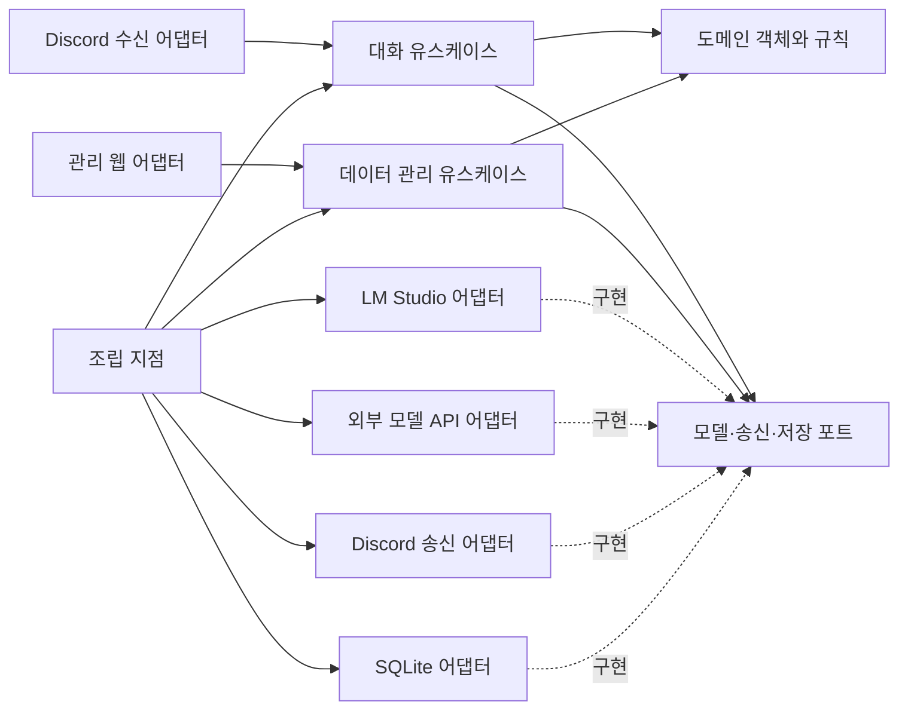

# ai-companion 기본 설계

검토용 설계 초안이다. 아래 구조와 수치는 구현 제안이며 확정 기술 결정이나 측정 결과가 아니다. 목표·작업 상태·일정은 [프로젝트 문서](프로젝트.md)를 원본으로 삼는다.

2026-09-13 [Python·LM Studio 초기 연결 결정](결정/001-Python-LMStudio-초기연결.md)에 따라 작성한 구현은 백업 e625daf에 보존했다. main은 환경·설계 기준이며 기능은 feature 브랜치에서 리뷰한다. 아래는 전체 목표 설계로, 코드의 존재·검증·병합 상태는 [프로젝트 문서](프로젝트.md)를 따른다. DB·화면·삭제·revision 정책은 후속 설계다.

## 설계 방향

하나의 애플리케이션을 도메인, 유스케이스, 외부 어댑터로 나눈다. 객체는 상태와 규칙을 소유하고, 외부 교체 지점은 작은 인터페이스로 표현한다. 깊은 상속 계층보다 합성과 생성자 주입을 사용한다. 모든 클래스를 추상화하거나 범용 플러그인 시스템을 먼저 만들지는 않는다.

첫 연결은 Python, discord.py, LM Studio로 구현한다. SQLite, FastAPI와 서버 렌더링 HTML, 외부 모델 API는 후속 후보이다. 초기 조사에서 검토한 Ollama는 첫 연결 대상에서 LM Studio로 변경했다. [기술 조사](조사/001-MVP-기술경계.md)와 [언어 비교](조사/002-개발언어-비교.md)는 당시 검토 기록으로 보존한다. 모델 이름·버전·양자화는 실행 환경을 확인한 뒤 고정한다.

## 의존성 경계

다음 그림은 실행 배치가 아닌 코드 의존성을 보여 준다. 어댑터가 안쪽 포트를 구현하고, 조립 지점에서 구현체를 주입한다.



| 객체·경계 | 책임 | 경계 밖으로 내보내지 않을 것 |
| --- | --- | --- |
| `Persona` | 말투·호칭·선호 표현·응답 길이 설정 검증, 버전이 있는 변경 | DB 행, 프롬프트 템플릿 전체 |
| `UserFact` | 사용자가 등록한 사실·활성 여부·출처와 변경 버전 | 모델의 추측을 확정 사실로 취급하는 규칙 |
| `Conversation` / `Message` | 내부 대화 ID, 발화자, 순서, 시각, 전송 상태 | Discord 메시지 객체 |
| `ConversationService` | 입력 중복 확인, 컨텍스트 구성, 모델 호출, 버전 재검증, 전달 조정 | 공급자별 HTTP 필드와 SDK 호출 |
| `ContextBuilder` | 현재 페르소나·활성 사실·최근 대화를 예산 안에 배치 | DB 질의, 네트워크 호출 |
| `ReplyPolicy` | 텍스트 정리, 길이·빈 응답 검사, 안전한 대체 안내 | 특정 모델별 분기 |
| `ProfileService` | 페르소나·사실 수정, 대화 삭제, 버전 충돌 검사 | 브라우저 폼과 Discord 명령 형식 |
| `ChatModel` | 공급자 중립 입력 → 텍스트 결과·사용량·종료 사유 | 공급자 응답 객체, 내부 추론 출력 |
| `MessageSink` | 대상에게 텍스트 전송, 선택적 처리 중 표시, 전송 결과 반환 | 플랫폼 ID의 해석 규칙 |
| `ConversationRepository` / `ProfileRepository` | 조회·저장·트랜잭션 경계 제공 | SQL·ORM 객체 |

Python이라면 외부 포트는 `typing.Protocol` 후보, 도메인 값은 dataclass 후보다. 공유되는 실질 동작이 없다면 공통 부모 클래스를 만들지 않는다. 단순한 길이 계산은 함수로 두어도 된다.

### 최소 포트 계약

다음은 구현 전 계약의 형태다. 실행 가능한 소스가 아니다.

```text
ChatModel.generate(ChatRequest) -> ChatResult
  ChatRequest: messages, output_limit, timeout, request_id
  ChatResult: text, finish_reason, usage(optional)
  실패: ModelUnavailable / ModelTimeout / InvalidOutput

MessageSink.send(ConversationAddress, OutgoingMessage) -> DeliveryResult
  OutgoingMessage: text, local_delivery_id
  DeliveryResult: sent / failed / unknown, external_message_id(optional)
MessageSink.show_typing(ConversationAddress) -> optional capability

ProfileRepository.load_snapshot(companion_id, user_id) -> ProfileSnapshot
ProfileRepository.save_changes(changes, expected_revision) -> new_revision
ConversationRepository.load_recent(conversation_id, limit) -> Messages
```

`ConversationAddress`는 메신저 종류와 외부 대화 ID를 가진 불투명 주소다. 코어는 전달만 하며 플랫폼별 해석은 어댑터가 맡는다. 도메인 `user_id`는 Discord 사용자 ID와 별개이고, `(platform, external_user_id)` 매핑을 둔다. 이름이 같다는 이유로 계정을 자동 통합하지 않는다.

모델 교체는 두 수준으로 구분한다. 같은 공급자 안의 모델 변경은 설정 변경이고, 다른 API 공급자로의 교체는 새 `ChatModel` 구현과 조립 설정 변경이다. 도메인·유스케이스는 수정하지 않는 것이 목표다. API가 비슷해도 구조화 출력·스트리밍·컨텍스트 한도·토큰 계산은 같다고 가정하지 않는다. 최소 계약은 텍스트 생성이며 고급 기능은 능력 정보로 협상한다. 원격 모델로 자동 우회하지 않는다.

메신저도 수신 이벤트를 `IncomingMessage`로 변환하고 송신 포트를 구현한다. 타이핑 표시가 없는 메신저에서는 해당 기능을 생략한다. 실제 두 번째 어댑터를 붙이기 전까지 교체 용이성은 가설이다.

### 로컬 LLM과 외부 API

사용자 요구에 따라 두 경로 모두 초기 설계·MVP 검증 범위에 포함한다. 첫 feature에서 `LMStudioChatModel`을 제공하고, 선정할 공급자의 `ApiChatModel`은 후속으로 같은 `ChatModel` 포트를 구현한다. 첫 요청은 LM Studio로 연결한다. 여러 공급자를 한꺼번에 구현하거나 요청마다 자동 선택하는 것은 후속 범위다.

설정 프로필은 provider, model, endpoint, credential reference, timeout, output limit을 가진다. 키 값 자체는 비밀 설정에서 읽는다. 공급자별 옵션은 해당 어댑터가 검증하고, 지원하지 않는 옵션은 명시적으로 거부한다. API 키 누락·인증 실패·요청 제한·시간 초과는 구분된 상태로 표시한다. 재시도는 제한하고 요청·토큰 사용량을 기록한다.

관리 화면에는 현재 로컬/API 모드와 모델을 표시한다. 외부 API 모드에서 선택한 페르소나·사실·대화 컨텍스트가 공급자로 전송된다는 점을 설정 화면에서 설명한다. 데이터 저장은 로컬에 유지해도 추론 입력까지 로컬에만 머무르는 것은 아니다. 사용자가 선택한 프로필을 따르고 자동 원격 전환은 기본 동작으로 넣지 않는다. 공급자별 보존 정책과 비용은 R07에서 실제 문서로 조사한다.

## 한 턴의 처리

1. Discord 어댑터가 DM 여부·허용 사용자·봇 발화 여부를 검사하고 내부 입력으로 변환한다.
2. `(platform, external_message_id)` 고유 키로 재수신을 식별하고 사용자 메시지를 저장한다. 대화별 큐를 통해 입력 순서대로 처리한다.
3. 짧은 읽기 트랜잭션으로 페르소나·사용자 사실·최근 대화·revision을 스냅샷으로 읽는다. 현재 입력은 한 번만 포함한다.
4. `ContextBuilder`가 규칙, 페르소나, 구분된 사용자 사실, 최근 대화를 구성한다. 저장된 사실과 대화 텍스트를 애플리케이션 명령으로 실행하지 않는다.
5. 모델을 비동기로 호출한다. DB 트랜잭션이나 DB 쓰기 잠금을 모델 응답 동안 유지하지 않는다. 타이핑 표시 수명은 호출 종료·실패·취소에 맞춰 닫는다.
6. `ReplyPolicy`가 빈 출력·과도한 길이를 검사한다. MVP는 짧은 텍스트 한 개만 전송한다. 구조화 출력 실패 시 JSON이나 내부 오류를 그대로 보내지 않는다.
7. 송신 직전에 데이터 revision과 삭제 세대를 확인한다. 변경됐다면 미전송 결과를 폐기하고 최신 상태로 최대 한 번 재생성한다. 다시 변경되면 해당 턴을 취소 상태로 남긴다.
8. 송신 결과를 기록한다. 성공한 응답만 전달된 대화로 취급한다. 실패·결과 불명 상태를 사용자에게 보낸 대화로 섞지 않는다.

입력 큐는 상한을 두고 초과 시 대기 안내를 한다. 추론 동시 실행도 초기에는 1개로 제한하는 안을 검토한다. 추가 사용자 메시지는 다음 턴에 처리하고, 연속 입력을 묶는 방식은 후속 UX 실험으로 둔다.

네트워크 전송과 로컬 DB 저장은 하나의 트랜잭션이 아니다. 보내기 전 기록과 성공 후 외부 메시지 ID를 남기되, 송신 후 프로세스가 죽으면 결과가 불명확할 수 있다. 이 상태를 자동 재전송하지 않고 관리 화면에 노출한다. MVP에서 외부 전송의 exactly-once를 보장한다고 주장하지 않는다. 재시작 시 처리 중이던 턴은 중단 상태로 표시하며 자동으로 오래된 답변을 발송하지 않는다.

## 데이터 구조

실행 데이터의 원본은 애플리케이션 DB다. Markdown 페르소나 파일과 DB를 동시에 편집 가능한 원본으로 두지 않는다. 향후 파일 가져오기·내보내기는 명시적 동작으로 추가할 수 있다.

| 데이터 | 주요 필드 | MVP 규칙 |
| --- | --- | --- |
| 사용자·외부 ID 매핑 | 내부 ID, platform, external ID | 조회마다 사용자 범위 확인, 플랫폼/외부 ID 고유성 |
| 페르소나 | companion ID, 이름, 말투, 성격, 호칭, 길이 설정, revision | 필드 검증 후 원자적으로 저장 |
| 사용자 사실 | fact ID, user ID, 내용, active, source, revision | 수동 등록만 허용, source는 manual. 자동 추출은 추후 source message ID 포함 |
| 대화·메시지 | conversation ID, user ID, companion ID, role, text, timestamp, external ID, delivery state | 시간은 UTC 저장, 화면에서 사용자 시간대 표시 |
| 변경 메타데이터 | 대상 ID, revision, 변경 시각, 작업 종류 | 민감한 이전 원문 전체를 감사 로그에 복제하지 않음 |
| 턴 메타데이터 | request ID, 적용 revision, 모델 식별자, 지연, 오류 종류 | 전체 프롬프트·토큰·내부 추론을 기본 로그로 남기지 않음 |

페르소나는 Companion의 설정이고, 사용자 사실은 실제 사용자 데이터다. 관계 상태와 가상 일상은 후속 독립 개념으로 남기며 MVP 테이블을 미리 만들지 않는다. 가상의 캐릭터 경험을 사용자에 대한 사실로 저장하지 않는다.

최근 대화는 우선 최대 20개 메시지를 컨텍스트 후보로 삼되, 모델별 입력 예산을 추가로 적용한다. 필수 지시와 새 입력을 우선 보존하고 오래된 대화를 줄인다. 사실은 활성 상태와 개수·길이 상한을 적용하며, 예산에서 빠진 항목을 관리 화면에 표시한다. 이 20개는 프롬프트 구성 상한의 초깃값 제안이며 DB 보존 기간을 뜻하지 않는다. 보존 기간은 별도 설정으로 정하고 자동 무기한 보존을 제품 기본값으로 확정하지 않는다.

## 실시간 확인·커스텀의 의미

최소 화면은 페르소나, 사용자 사실, 대화 기록의 세 영역으로 구성한다. 현재 DB 값과 각 값의 수정 시각·revision을 표시한다. 마지막 턴에 실제로 적용된 revision, 사용한 사실 ID, 컨텍스트 제외 여부도 조회한다. 비밀키나 내부 추론을 보여 주는 화면은 만들지 않는다.

- 저장 응답은 실제 DB 커밋 이후 성공으로 표시한다. 폼에는 저장 중·성공·실패를 구분한다.
- 편집 시 읽었던 revision을 전송한다. 다른 편집으로 값이 바뀌었다면 충돌을 알리고 새 값을 읽도록 한다. 조용히 덮어쓰지 않는다.
- 저장 완료 뒤 시작되는 턴은 새 값을 사용한다. 진행 중 턴은 송신 전 revision 검사로 이전 결과를 폐기한다.
- 첫 화면은 2초 간격 polling을 제안한다. 저장 결과는 즉시 표시하고 다른 변경의 조회 갱신은 정상 연결에서 약 2초 이내를 목표로 한다. 이는 측정 전 목표이며 WebSocket을 필수로 하지 않는다.
- 송신 직전 검사와 변경 커밋은 같은 대화 범위의 동기화 규칙을 사용한다. 이미 외부 송신이 시작된 응답은 철회가 보장되지 않으며 화면에 그 경계를 설명한다.
- 삭제 시 저장된 원문, 캐시, 진행 중 미전송 출력과 파생 데이터의 유효성을 함께 처리한다. MVP에는 벡터 색인이 없지만 이후 추가 시 삭제 전파 대상에 포함한다.

사실 하나를 삭제해도 과거 대화의 같은 문장이 자동으로 지워지는 것은 아니다. UI에서 ‘이 사실만 삭제’와 ‘관련 대화도 삭제’의 범위를 명시한다. 원격 메신저에 이미 전달된 메시지나 별도 백업까지 로컬 삭제가 전파됐다고 표시하지 않는다. 삭제 회수·백업 보존 정책은 실제 배포 시 문서화한다.

로컬 관리 화면은 loopback에 바인딩하고 관리자 인증과 변경 요청 보호를 둔다. 브라우저에서 실행되는 외부 사이트가 변경 API를 호출하지 못하도록 Origin/CSRF 검증을 적용한다. DB 접근의 user ID는 화면 입력을 그대로 신뢰하지 않는다. HTML은 이스케이프하며 페르소나·기억을 실행 코드로 해석하지 않는다. 다른 기기 접근이 필요하면 접속 방식·인증·TLS를 추가 설계한다.

## 실행과 코드 배치 제안

단일 애플리케이션 프로세스에서 Discord 연결과 관리 API 수명을 함께 관리한다. 웹 worker 수는 1개로 시작해 봇이 중복 연결되지 않도록 한다. SQLite 작업은 짧게 수행하고 이벤트 루프를 막지 않도록 실행한다. 종료 시 입력 수신 중지, 진행 요청 취소·상태 기록, DB·HTTP 연결 종료 순서를 둔다.

아래는 같은 프로젝트 루트에서 확장할 때 참고할 구조다. 실제 첫 연결 버전은 [README의 파일 구조](../README.md#구조와-확장)를 따른다.

```text
src/ai_companion/
  domain/          # 페르소나, 사실, 대화, 값 객체
  application/     # 대화·관리 유스케이스와 포트
  adapters/
    discord/       # 수신 변환과 송신
    lmstudio/      # LM Studio 모델 요청·결과 변환
    model_api/     # 선정한 외부 공급자의 요청·결과 변환
    sqlite/        # 저장소와 마이그레이션
    admin_web/     # API, 폼, 템플릿
  bootstrap.py     # 설정, 객체 조립, 시작·종료
tests/             # 유스케이스, 어댑터 계약, 통합 시나리오
```

비밀키·DB·사용자 로그는 버전 관리에서 제외한다. 실행 설정에는 메신저 종류, 허용 사용자, 모델 공급자·이름·주소, DB 경로를 두고 데이터 수정과 분리한다. 모델 교체는 MVP에서 설정 변경 후 재시작을 허용하며, 페르소나·사실 수정은 재시작을 요구하지 않는다.

## 구현 검증 기준

| 검증 | 확인할 실패 또는 보장 |
| --- | --- |
| 코어 독립성 | SDK 없이 가짜 포트로 대화·수정·삭제 유스케이스 실행 |
| 어댑터 계약 | 정상 텍스트, 빈 응답, timeout, 취소, 공급자 오류를 공통 결과로 변환 |
| 데이터 격리 | 테스트용 서로 다른 사용자·대화에 기록이 섞이지 않음 |
| 동시 수정 | 오래된 revision 저장 거부, 생성 중 수정 시 이전 결과 미전송 |
| 삭제 | 새 컨텍스트·화면·미전송 출력에서 삭제 기록 제외 |
| 장애 | 중복 수신, 모델 중단, 송신 결과 불명, 프로세스 재시작에 대한 상태 확인 |
| 대화 품질 | 같은 합성 한국어 사례로 장문·질문 과다·잘못된 기억과 체감 지연 기록 |

첫 모델 평가 전 보편적인 속도·품질 기준을 확정하지 않는다. 수치 목표를 정하면 모델·하드웨어·입력 길이와 함께 남긴다.

[프로젝트와 작업 목록](프로젝트.md) · [근거와 미확인 사항](조사/001-MVP-기술경계.md)
