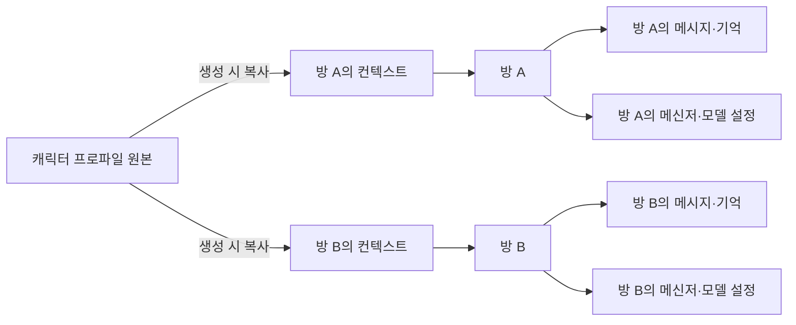

# 방 중심 개인용 채팅 시스템 기초 설계

2026-09-17 추가 요구사항까지 반영한 설계 초안이다. 개인 서버 또는 개인 애플리케이션에서 캐릭터 프로파일로 방을 만들고, 방별 컨텍스트와 연결을 편집하며, 모든 저장 데이터를 재시작 후 복구하는 채팅 기반을 목표로 한다. 자연스러운 응답 연출, 자동 기억, 관계·일상 시뮬레이션은 이후 확장한다. 아래 사용자 요구 외의 객체 구성과 처리 정책은 구현 제안이며, 구현 완료나 승인된 ADR을 뜻하지 않는다.

현재 설계 논의의 원본은 이 문서다. [이전 기본 설계](기본설계.md)는 초기 Companion 설계의 참고 기록, [프로젝트 문서](프로젝트.md#작업-목록)는 작업 상태의 원본이다.

테이블·FK·설정 화면의 항목은 [데이터 ERD](데이터설계.md)에서 구체화한다. 아래 개념과 실제 테이블은 반드시 일대일로 대응하지 않는다.

## 사용자 요구사항

1. 사용자는 Telegram·Discord 등 지원하는 채팅 서비스의 계정을 연동한다.
2. 로컬 LLM 서버 또는 API 키를 사용하는 모델 연결을 등록한다.
3. 사용자는 자신의 페르소나를 설정하고, 캐릭터의 페르소나와 관련 설정을 묶은 프로파일을 자유롭게 등록한다.
4. 캐릭터 프로파일을 선택해 방을 생성한다. 같은 프로파일로 만든 여러 방도 독립적인 대화와 기억을 가진다.
5. 방 안에서 연결 채팅 서비스, 모델, 본인 페르소나, 캐릭터 페르소나를 수정·변경한다. 페르소나는 다른 프로파일 선택으로 교체하는 방식이 아니라 해당 방의 컨텍스트를 직접 편집한다.
6. 방을 다시 열면 그 방의 대화를 이어간다. ‘새 대화’는 별도의 방을 생성한다.
7. 방을 삭제하면 내부 대화와 관련 기억을 포함한 해당 방의 데이터를 모두 삭제한다.
8. 개인 서버 또는 개인 애플리케이션으로 운영한다. 프로파일, 연결 설정, 방별 컨텍스트, 대화와 관련 기억은 저장되며 재시작으로 유실되지 않는다.

이 추가 요구는 앞선 ‘캐릭터 프로파일 전환으로 방을 찾는 방식’을 ‘방을 선택해 재개하는 방식’으로 구체화한다. 페르소나 수정만으로 방을 자동 생성하거나 다른 방으로 이동하지 않는다. 초기 범위는 개인 소유자와 여러 방이며, 회원가입·공용 서비스·다중 사용자 운영을 전제하지 않는다.

## 중심 개념

| 개념 | 의미와 책임 |
| --- | --- |
| 개인 소유자 | 이 설치의 설정·연결·방을 관리하는 사람. 여러 외부 계정을 연결할 수 있으며 별도 회원 시스템은 초기 필수가 아님 |
| 메신저 계정 연결 `AccountLink` | 인증된 외부 사용자 ID와 내부 사용자의 연결. 표시 이름만으로 계정을 통합하지 않음 |
| 메신저 접속 `MessengerConnection` | 봇 등 실제 수신·송신 주체와 연결 설정. 사용자 계정 연결과 별개 |
| 모델 연결과 모델 프리셋 | 연결은 API 종류·주소·인증을, 프리셋은 그 연결의 모델 ID·생성 옵션을 보관. 방에는 적용할 프리셋의 설정을 복사 |
| 개인 페르소나 `UserPersona` | 여러 개 등록하는 이름·자기소개·역할의 원본. 방 생성 시 선택한 내용을 복사 |
| 프롬프트 템플릿 | 응답 방식 등 재사용할 지시. 방 생성 시 복사하고 방 안에서 내용·순서를 편집 |
| 캐릭터 프로파일 `CharacterProfile` | 자유롭게 등록하는 재사용 가능한 방 생성용 원본. 캐릭터 페르소나와 관련 설정을 보관하며 대화 이력과 모델 키는 포함하지 않음 |
| 방 `Conversation` | 고유 ID, 방 이름, 방별 설정, 메시지와 기억의 소유 단위. 생성·재개·삭제의 기준 |
| 방 컨텍스트 `RoomContext` | 사용자 페르소나와 캐릭터 페르소나·관련 설정의 방 전용 사본. 사용자가 직접 편집하고 버전을 부여 |
| 방 연결 설정 `RoomSettings` | 이 방에서 사용할 메신저·모델 연결과 요청 옵션. 공용 연결은 참조하고 방 전용 옵션은 자체 보관 |
| 메시지·기억 | 방에 소속된 대화 원문과 파생 데이터. 같은 캐릭터여도 다른 방과 공유하지 않음 |
| 외부 방 연결 `ChannelBinding` | 메신저의 채팅·채널·토픽과 내부 대화를 연결. 화면에 방을 만드는 방식은 어댑터가 담당 |

처음부터 이 개념마다 서비스나 프로세스를 만들 필요는 없다. 기존 Python 애플리케이션 안에서 데이터와 책임을 구분한다.

독립된 재사용 `ChatConfiguration` 객체를 초기 필수에서 빼고 조립 결과를 방의 설정으로 저장한다. 같은 프로파일로 여러 방을 만들 수 있으므로 캐릭터 ID를 방 ID로 사용하지 않는다. 방 컨텍스트·메시지·기억은 `conversation_id`에 속하며 외부 채널 ID는 전달 주소다.

방 생성 시 선택한 프로파일의 내용을 복사해 방 컨텍스트로 저장한다. 원본 프로파일을 수정해도 이미 생성한 방에는 자동 전파하지 않으며, 방에서 편집한 내용도 원본이나 다른 방에 반영하지 않는다. 원본 ID·버전은 출처 표시용으로 남길 수 있지만 방 실행은 저장된 사본을 사용한다. 원본을 제거해도 기존 방의 사본을 유지하는 방식을 제안한다.

컨텍스트 편집의 대상은 사용자가 설정하는 페르소나와 관련 지시다. 과거 메시지나 자동 생성된 기억의 원문을 일괄 변경하는 동작은 포함하지 않는다. 방 전용 사용자 페르소나도 같은 독립성 원칙을 따른다.

## 기본 이용 흐름

1. 사용자가 메신저 계정 연결과 모델 연결을 등록하고 연결 가능 여부를 확인한다.
2. 캐릭터 프로파일을 등록하고, 그중 하나를 선택해 새 방을 만든다.
3. 프로파일 사본과 본인 페르소나, 메신저·모델 선택을 방의 설정으로 저장한다.
4. 외부 방과 연결한다. 연결 실패 시 내부 방과 설정은 보존하고 연결 미완료로 표시한다.
5. 메시지를 받으면 인증된 발신자·연결·방/토픽으로 내부 방을 찾고, 그 방의 컨텍스트와 기록만 모델에 전달한다.
6. 방 안에서 설정을 수정하고 계속 대화한다. 다른 방을 선택하면 그 방의 저장된 설정과 기록을 재개한다.
7. 방을 삭제하면 해당 방의 컨텍스트·메시지·기억 등을 제거한다. 프로파일 원본은 남아 새 방을 만들 때 다시 사용할 수 있다.

개인 설치에서 사용자가 자신의 봇 연결을 등록하고 소유가 확인된 계정만 사용하도록 하는 안을 제안한다. 구체적인 계정 연동·봇 인증 절차는 후속 설계다. 사용자의 일반 계정으로 대신 메시지를 보내는 기능은 별도 요구로 취급한다.

로컬 모델의 주소는 애플리케이션 서버가 접근하는 주소다. 서버가 원격에 있으면 사용자의 PC에서 실행되는 `localhost`와 같지 않으므로, 배포 위치를 정할 때 연결 방식을 함께 정한다.

## 변경 시 대화 처리 제안

방 안에서 컨텍스트와 연결을 수정해도 같은 방을 유지하는 것은 사용자 요구다. 버전 관리와 적용 시점의 세부 정책은 아래처럼 제안한다.

| 변경 | 현재 대화 처리 | 기록 처리 |
| --- | --- | --- |
| 모델 또는 API 키 변경 | 같은 대화에서 다음 턴부터 적용 | 이전 기록 유지, 턴마다 실제 사용한 모델·설정 버전 기록 |
| 메신저 변경 | 같은 내부 대화를 새 외부 방으로 연결 가능 | 내부 기록 유지. 기존 메시지를 새 메신저에 자동 복사하지 않음 |
| 방의 사용자 페르소나 편집 | 같은 방에서 다음 턴부터 새 버전 적용 | 과거 메시지는 보존. 원본·다른 방에 영향 없음 |
| 방의 캐릭터 페르소나·관련 설정 편집 | 같은 방에서 다음 턴부터 새 버전 적용 | 성격·배경을 크게 바꿔도 자동으로 새 방을 만들지 않음 |
| 프로파일 목록의 원본 편집 | 이후 새 방의 초기값에 적용 | 기존 방의 컨텍스트·기록은 보존 |
| 같은 프로파일로 새 대화 시작 | 새 `conversation_id` 생성 | 해당 원본의 초기값만 복사하고 기존 방의 메시지·기억은 복사하지 않음 |
| 기존 방 선택 | 선택한 방 재개 | 그 방의 저장된 컨텍스트·메시지·기억 사용 |
| 방 삭제 | 그 방의 수신·생성·송신 중지 | 방 소유 데이터 전체 제거. 삭제 범위는 아래 규칙 참조 |

방 A→방 B→방 A 전환은 A의 기록을 이어가는 동작이다. A 안에서 이름·성격을 편집하는 것은 A의 컨텍스트 변경이며 다른 프로파일이나 방 선택으로 해석하지 않는다.

이전 대화와 수정한 페르소나가 충돌할 수 있다. 새 컨텍스트를 현재 설정의 기준으로 사용하고 과거 발화는 당시 기록으로 남기는 방식을 제안한다. 파생 기억을 도입하면 생성 당시 컨텍스트 버전을 기록하고, 설정 변경으로 낡아진 요약·기억은 재검토 또는 재생성 전까지 현재 사실로 사용하지 않는다. 페르소나 수정만으로 과거 메시지까지 자동 수정·삭제하지 않는다.

방 안에서 모델·메신저를 변경할 때는 그 방의 연결 참조와 옵션을 바꾼다. 여러 방이 참조하는 공용 연결 정의나 API 키를 편집하는 기능은 연결 관리 화면에서 영향받는 방을 표시하도록 제안한다. API 키 원문은 방 컨텍스트에 복사하지 않는다.

로컬 모델에서 외부 API로 바꾸는 화면에는 이후 요청에 포함될 기존 대화 맥락도 새 공급자로 전송될 수 있음을 표시한다. 지원하지 않는 연결이나 옵션은 저장·적용 단계에서 알려 주며 자동으로 다른 공급자로 바꾸지 않는다.

## 전환과 기록 분리의 기준

- `conversation_id`는 외부 방과 독립적인 내부 ID로 둔다. 모든 메시지·요약·기억·향후 검색 색인에 방 소속을 지정한다. 같은 프로파일에서 생성한 방도 공유 기억을 자동으로 만들지 않는다.
- 토픽이 없는 동일 외부 방에는 한 번에 하나의 활성 내부 방만 연결한다. 여러 방이 같은 전달 주소를 사용하면 활성 방을 명시적으로 선택한다. 토픽이 있으면 토픽까지 포함한 주소로 구분한다.
- 입력을 수락할 때 방 ID, 컨텍스트·연결 설정 버전, 외부 방 연결의 전환 세대를 고정한다. 큐의 옛 입력을 전환 후 다른 방에 재배정하지 않는다.
- 변경은 검증된 설정과 활성 대화 연결을 한 번에 반영한다. 생성 중 변경되면 이전 설정의 미전송 결과를 취소하는 안을 우선 제안한다. 이미 외부 전송이 시작된 메시지는 철회가 보장되지 않으며 새 대화 기록으로 옮기지 않는다.
- 분리의 기준은 화면의 구분선이 아니라 내부 기록과 모델 입력이다. 예전 메시지에 대한 답글이 다른 대화에 속하면 자동으로 옛 맥락을 넣지 않고 전환 또는 재입력을 안내한다.
- 초기에는 하나의 대화에 활성 메신저 연결 하나를 제안한다. 여러 메신저에서 동시에 같은 대화를 이어가거나 기록을 동기화하는 기능은 별도 논의한다.
- 재시작 후에도 설정, 대화, 방 연결을 복구할 수 있어야 한다. 연결 해제는 대화 삭제와 구별한다.

## 방 삭제와 데이터 소유권

사용자가 삭제하는 단위는 내부 방이다. 삭제는 숨김·보관 처리만으로 완료하지 않는다.

| 삭제되는 해당 방의 데이터 | 방 삭제로 함께 지우지 않는 공용 데이터 |
| --- | --- |
| 방 정보, 컨텍스트 사본과 이전 버전, 연결 선택·옵션 | 캐릭터 프로파일 원본, 재사용 사용자 페르소나 원본이 있는 경우 그 원본 |
| 수신·응답 메시지, 턴 기록, 전송 상태 | 다른 방의 컨텍스트·대화·기억 |
| 요약·추출 기억·임베딩·검색 색인 등 존재하는 파생 데이터 | 공용 메신저·모델 연결 정의와 다른 방에서도 사용하는 인증정보 |
| 캐시, 대기 입력, 미전송 출력, 방 전용 작업·첨부파일이 있는 경우 그 데이터 | 외부 서비스에 이미 전달된 메시지, 사용자가 별도로 만든 내보내기·백업 |

삭제 과정의 제안:

1. 삭제 시작 상태를 영구 저장하고 외부 방의 활성 연결을 해제한다. 해당 방으로 새 입력·모델 호출·송신을 시작하지 않는다.
2. 실행 중 요청을 취소하고, 늦게 돌아온 결과도 삭제 상태·버전을 확인해 저장·전송하지 않는다. 삭제 전 시작된 외부 송신의 철회는 보장하지 않는다.
3. DB의 방 소유 데이터를 삭제하고 방 전용 캐시·파일·색인을 정리한다. 삭제 진행 관리에는 원문 없이 최소한의 방 ID와 정리 상태만 둔다.
4. 정리가 끝난 뒤 삭제 완료로 표시한다. 중간 실패·재시작 때는 정리를 재개하고 완료 시 임시 정리 기록도 제거한다. 삭제된 방 ID는 재사용하지 않는다.

남아 있는 외부 메시지나 지연 이벤트로 삭제된 방을 자동 복원하지 않는다. 내부 연결이 없는 입력은 새 방 생성·연결을 명시적으로 요청하도록 한다. 외부 메시지 ID 매핑으로 다른 방의 기록에 접근하지 못하게 한다.

내부 삭제 완료와 외부 메신저 기록 삭제는 별개다. 별도 백업·내보내기까지 삭제되었다고 표시하지 않으며, 향후 앱 자체 백업을 제공할 경우 보존·복원 시 삭제 반영 정책을 추가한다. 초기 ‘모두 삭제’ 계약은 앱이 관리하는 실행 데이터와 파생 데이터 전체를 대상으로 한다.

## 저장과 재시작 복구

개인 서버와 개인 앱 모두 영구 저장소를 데이터 원본으로 사용한다. 메모리는 캐시 용도이며, 정상 종료 시에만 한꺼번에 저장하는 방식으로 구현하지 않는다. 저장 성공은 영구 저장이 끝난 뒤 알린다.

| 저장 대상 | 재시작 후 동작 |
| --- | --- |
| 프로파일 원본, 메신저 계정·모델 연결, 비밀정보의 보호된 저장 위치·참조 | 등록 정보 복구. 비밀정보도 재접근 가능해야 하며 키가 없으면 연결 오류로 표시 |
| 방 목록, 방별 컨텍스트·설정과 버전, 외부 방 대응 | 동일 방 ID와 적용 설정 복구. 연결 실패해도 데이터를 초기화하지 않음 |
| 수락한 입력, 생성된 응답, 전송 결과, 중복 수신 식별 정보 | 저장된 기록 유지. 중복 이벤트를 새 대화로 저장하지 않음 |
| 방별 기억·요약 등 생성된 파생 데이터 | 같은 방으로 복구. 검색 색인을 재구성하더라도 다른 방의 데이터가 섞이지 않음 |
| 처리 중 요청과 삭제 진행 상태 | 중단된 요청을 식별하고 미완료 삭제를 재개 |

입력은 작업 큐에만 넣지 않고 처리 전에 저장한다. 응답 내용과 전송 상태도 별도로 기록한다. 외부 송신과 로컬 저장은 하나의 원자적 작업이 아니므로 재시작 후 송신 결과가 불명확한 턴은 그 상태를 유지하고 자동 재전송하지 않는 안을 제안한다. 중단된 생성은 기록을 보존한 채 사용자 재시도를 허용한다.

DB·방 전용 파일·비밀정보 저장 위치는 임시 디렉터리나 프로세스 메모리가 아닌 지속 데이터 경로로 지정한다. 초기 DB 후보는 기존 설계의 SQLite이며, 저장 엔진·스키마·비밀정보 보관 방식은 상세 설계에서 확정한다. 재시작 복구와 디스크 손상·분실에 대한 백업은 별개의 범위다.

## Discord와 Telegram에서 보이는 방

내부 기록의 분리와 메신저 화면의 분리는 각각 설계해야 한다. 내부 대화를 바꿔도 외부 서비스에 이미 보낸 기록은 남는다. 외부 방 이름을 바꾸거나 안내 메시지를 보내는 것만으로 과거 기록이 분리되지는 않는다.

2026-09-17 공식 문서 확인 결과:

| 방식 | 화면 분리 가능성 | 적용 제안과 한계 |
| --- | --- | --- |
| Discord 봇 DM | 같은 봇·사용자의 기존 DM을 다시 반환 | 공통 최소 방식은 내부 방 선택·현재 방 표시·전환 안내. 과거 기록은 같은 화면에 남음 |
| Discord 서버 채널·비공개 스레드 | 서버 안에서 별도 공간 제공 가능 | 내부 대화별 공간 후보. 서버 참여와 권한 설정이 필요하며 DM과 같은 사용 경험은 아님 |
| Telegram 봇 개인 채팅의 토픽 | 개인 채팅 안에서 여러 토픽 제공 | BotFather에서 활성화한 뒤 대화별 토픽 연결을 우선 검증. 하나의 봇 안에서 화면 분리가 가능 |
| 자체 웹 채팅 | 내부 대화에 맞춰 화면 구성 가능 | 일관된 방 목록을 제공할 수 있지만 새 채팅 UI 개발이 필요하므로 선택 사항 |

근거: [Discord Create DM](https://docs.discord.com/developers/resources/user#create-dm), [Discord Threads](https://docs.discord.com/developers/topics/threads), [Telegram 개인 채팅 토픽](https://core.telegram.org/bots/features#topics-in-private-chats), [Telegram createForumTopic](https://core.telegram.org/bots/api#createforumtopic). 실제 계정·권한·클라이언트 조합의 동작은 아직 검증하지 않았다.

권장안은 내부 대화 분리를 공통 기능으로 만들고, 지원하는 메신저에서는 토픽·스레드와 대응시키는 것이다. Discord DM의 전환 안내는 기록 혼재를 완전히 해결하지 못하므로, 화면까지 분리해야 한다면 서버 기반 공간 또는 별도 웹 채팅을 선택해야 한다. 캐릭터별 봇을 따로 운영하는 방법도 있지만 관리할 연결과 인증정보가 늘어 기본안에서는 제외한다.

## 첫 기반에서 확인할 결과

다음은 구현 수용 기준의 제안이며 실제 결과가 아니다.

1. 캐릭터 프로파일을 등록하고 같은 프로파일로 방 A와 B를 생성한다. 메시지·기억·설정이 서로 독립적이다.
2. A의 사용자·캐릭터 컨텍스트를 수정해도 A의 방 ID와 기존 기록은 유지되고, 원본 프로파일과 B는 바뀌지 않는다. 원본 수정도 기존 방에 전파되지 않는다.
3. 방 A→B→A 이동 시 A의 이전 대화를 이어간다. ‘새 대화’로 생성한 방은 다른 방의 메시지·기억 없이 시작한다.
4. 모델이나 메신저를 바꿔도 방의 기록이 유실되지 않으며 이후 요청에 새 연결을 적용한다.
5. 편집·방 이동 전에 대기·생성 중이던 입력과 응답이 다른 방이나 이전 컨텍스트로 잘못 반영되지 않는다.
6. 재시작 후 프로파일·연결·비밀정보 참조·방 설정·대화·기억을 복구하고, 저장 실패 때 성공으로 표시하지 않는다.
7. A를 삭제하면 해당 방의 컨텍스트·대화·기억·파생 데이터가 제거되며 원본 프로파일·B·공용 연결은 유지된다. 늦은 응답·외부 재수신·재시작으로 A가 복원되지 않는다.
8. 삭제 도중 중단 후 재시작해도 정리를 끝내고, 외부 메신저의 과거 기록까지 삭제되었다고 표시하지 않는다.

자동 기억 추출, 수동 사실 관리의 별도 화면, 관계·생활 상태, 선제 메시지, 분할 전송·인위적 지연은 이 기반 이후에 다시 범위를 정한다. 현재 대화를 이어 가는 최근 메시지 컨텍스트와 기본 기록 보존은 이번 기반에 필요하다.

## 기존 구현과 후속 논의

기존 `ChatModel`·메신저 어댑터의 분리 방향은 재사용 후보다. 다만 현재 [ConversationKey](../src/ai_companion/domain.py)는 외부 주소와 외부 사용자로 구성되어 있고 [메모리 저장소](../src/ai_companion/adapters/memory.py)는 그 키로 기록을 저장한다. 새 요구에는 독립된 방 ID, 프로파일 사본, 방별 편집과 영구 저장·삭제 계약이 필요하다. 현재 메모리 저장 구현은 재시작 보존 요구를 충족하지 않는다. 아직 코드 변경은 하지 않았다.

다음 검토는 [데이터 ERD](데이터설계.md)의 테이블·관계와 설정 화면의 입력 항목을 기준으로 한다. 개인 앱/서버의 접속 방식, 비밀정보 보관, 첫 추가 메신저 채택은 계속 검토한다. 자동 기억 기능은 후속이지만 방 소유권과 삭제 전파 계약은 지금부터 적용한다. 기존 작업의 진행 증거는 [프로젝트 문서](프로젝트.md)에 남기며 새 범위의 구현 완료로 해석하지 않는다.

변경 이력: 최초 제안의 별도 채팅 구성과 캐릭터 전환 중심 구조를 추가 요구에 따라 방별 컨텍스트 편집 구조로 정리했다. 기존 대화를 재개한다는 요구는 방 선택 동작으로 유지한다.
