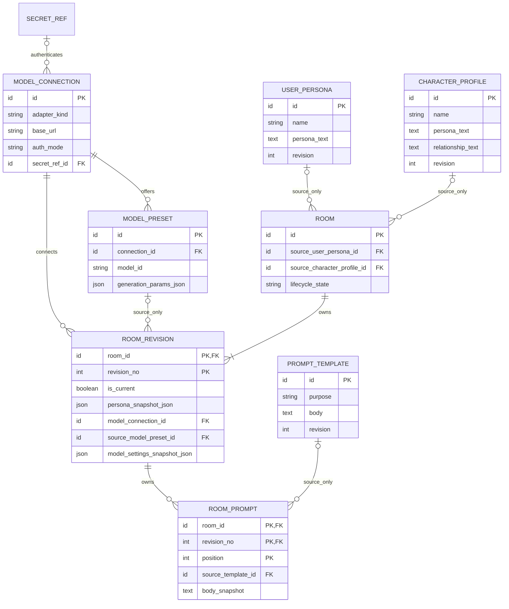
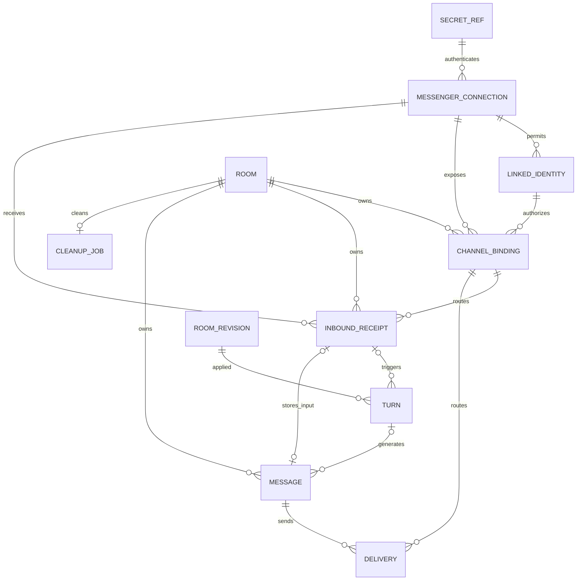
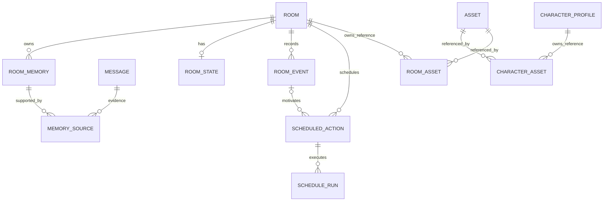

# 개인용 채팅 시스템 데이터 ERD 초안

2026-09-17 요구사항을 바탕으로 한 논리 설계다. 테이블·관계·설정 페이지의 책임을 검토하기 위한 초안이며 DB 생성·마이그레이션·구현은 하지 않았다. 사용자 경험과 삭제·복구 요구는 [기초 설계](기초설계.md), 데이터 구조의 원본은 이 문서, 작업 상태는 [프로젝트 문서](프로젝트.md#작업-목록)에서 관리한다.

개인 설치 하나와 개인 소유자 한 명을 기본으로 한다. 사용자 페르소나 여러 개는 여러 로그인 계정이라는 뜻이 아니다. 회원·조직·요금제 테이블은 현재 범위에 넣지 않는다. Telegram은 첫 추가 메신저 후보이며 채택 확정은 아니다.

## 구현 전 확인

아래 FK·CASCADE·트랜잭션 설명은 관련 데이터가 같은 DB에 존재하는 구성을 전제로 한다. [외부 라이브러리 저장 검토안](외부라이브러리-저장구조-검토안.md)은 파일 원본과 여러 DB를 제안하므로 그대로 동시에 적용할 수 없다. [구현 순서](프로젝트.md#구현-순서)의 I01에서 저장 경계를 결정하고 이 문서에 물리 배치·참조 검증·복구 계약을 반영한 뒤 마이그레이션을 작성한다.

자체 웹 채팅의 입력 식별·중복 방지·응답 경로, 방별 스케줄러 전체 ON/OFF도 후속 요구다. 각각 I05·I07 착수 전에 저장 계약을 보완한다. 첫 저장 구현은 프로파일·방·설정 버전부터 시작하며 후속 기억·관계·일정·에셋 테이블을 미리 전부 만들지 않는다.

## 1. 사용자 목록에서 구분·추가할 내용

| 입력 항목 | 설계에서 나눌 대상 | 이유 |
| --- | --- | --- |
| 모델 연결 | API 어댑터·서버 주소·인증정보 | HTTP는 요청 방식, API 키는 인증 수단, 로컬/원격은 서버 위치다. 서로 배타적인 연결 종류가 아님 |
| 모델 파라미터 | 모델 프리셋의 기본값, 방별 적용값, 실제 호출값 | 같은 서버에서 여러 모델을 쓰고 같은 모델을 다른 옵션으로 사용할 수 있음 |
| 프롬프트 | 재사용 템플릿과 방에 복사한 순서 있는 지시 | ‘짧게 답하기’는 지시, 출력 토큰 한도는 생성 옵션, 메시지 분할은 송신 정책으로 책임이 다름 |
| 개인·캐릭터 페르소나 | 여러 개 등록하는 원본과 방별 사본 | 원본 편집이 이미 생성한 방의 컨텍스트를 바꾸지 않아야 함 |
| 캐릭터 관계 정보 | 초기 관계·배경 설정과 현재 관계 상태 | ‘오래된 친구’라는 설정과 대화 중 변한 친밀도·기분은 다른 데이터 |
| 메신저 연동 | 봇 인증, 허용된 개인 계정, 채팅·토픽 주소 | 봇 토큰만으로 어떤 사람이 어느 방에 접근할지 결정할 수 없음 |
| 대화방 | 설정 버전, 메시지, 요청·전송 상태, 기억·출처 | 방 레코드에 모든 데이터를 JSON 하나로 넣으면 조회·격리·삭제·복구가 어려움 |
| 추가: 일정 | 사건 정보, 실행 예약, 실행 이력 | ‘내일 면접’이라는 기억은 자동 발송 동의나 실행 스케줄이 아님 |
| 추가: 운영 | 앱 설정, 비밀정보 참조, 수신 중복 방지, 삭제 정리 상태 | 재시작·중복 수신·삭제 중 종료를 처리하기 위한 저장 정보 |

## 2. 등록 데이터와 방 생성 ERD

`||`는 정확히 하나, `o|`는 없거나 하나, `o{`는 없거나 여러 개다. 아래 선은 FK 관계이고, 복사는 본문에 별도로 명시한다. 모든 `id`는 내부 식별자이며 외부 서비스 ID와 구별한다.

공용 원본을 관리하는 설정 페이지와 방 내부의 설정 화면을 구분한다.

### 등록용 테이블

아래 영문 테이블·컬럼 이름은 구현 시 사용할 후보 식별자다.

| 테이블 | 주요 필드 | 제약·설정 화면 |
| --- | --- | --- |
| `APP_SETTINGS` | `id=1 PK`, `timezone`, `locale`, `schema_version`, `preferences_json`, `updated_at` | 설치 공통 설정 하나. 데이터 경로·보관 설정 등의 허용 필드만 포함하고 자격증명·방 데이터는 넣지 않음 |
| `SECRET_REF` | `id PK`, `label`, `store_kind`, `locator`, `revision`, `updated_at` | 보호된 비밀 저장소의 참조. API 키·봇 토큰 원문을 일반 설정 JSON에 넣지 않음 |
| `MODEL_CONNECTION` | `id PK`, `name`, `adapter_kind`, `base_url`, `auth_mode`, `secret_ref_id FK?`, `transport_options_json`, `revision`, `enabled` | 지원하는 어댑터·주소·인증 선택, 접속 점검. `auth_mode=none`이면 비밀 참조 없음, 인증 필요 시 유효한 참조 필수 |
| `MODEL_PRESET` | `id PK`, `connection_id FK`, `name`, `model_id`, `generation_params_json`, `request_policy_json`, `schema_version`, `revision` | 한 연결에 여러 모델/파라미터 조합 등록. 표시 이름과 공급자 모델 ID 분리 |
| `PROMPT_TEMPLATE` | `id PK`, `name`, `purpose`, `body`, `variables_schema_json`, `revision` | 목적별 지시 등록·편집·미리보기. 초기는 `purpose=conversation`; 기억 추출 등의 목적은 후속 |
| `USER_PERSONA` | `id PK`, `name`, `persona_text`, `revision` | 개인 페르소나 여러 개 등록. 이름·자기소개·대화 속 역할을 관리하며 메신저 계정과 연결하지 않음 |
| `CHARACTER_PROFILE` | `id PK`, `name`, `description`, `persona_text`, `scenario_text`, `relationship_text`, `revision` | 캐릭터 여러 개 등록. 성격·말투, 배경, 사용자와의 초기 관계를 관리. 현재 기분·친밀도·기억은 넣지 않음 |

공통 등록 데이터에는 `created_at`, `updated_at`을 둔다. 필요한 JSON에는 별도의 구조 버전을 두고 정의된 필드·타입만 허용한다. FK·조회 조건·삭제 소속은 JSON에 숨기지 않는다. `?`는 NULL 허용을 뜻한다.

### 모델 연결·파라미터의 의미

예를 들어 ‘내 LM Studio’라는 연결에 주소, `lmstudio_chat_completions` 어댑터, 인증 여부를 등록하고, 그 아래 실제 모델 ID와 생성 옵션을 가진 프리셋들을 둔다. 원격 API도 해당 API 규격을 구현한 어댑터와 URL·인증을 등록한다. 어댑터는 등록 화면에서 지원 목록으로 선택하며, 임의 HTTP 본문·응답 파싱 스크립트 편집기는 초기 범위에 넣지 않는다.

| 연결·인증 유형 후보 | 필수 입력 | 유형별 검증 |
| --- | --- | --- |
| LM Studio HTTP API | `adapter_kind=lmstudio_chat_completions`, `base_url` | 같은 PC·개인 서버 모두 가능. 선택한 API 규격에 맞는 주소와 모델 ID 확인 |
| 호환 API 또는 공급자 전용 HTTP API | 구현된 어댑터 종류, `base_url`, 해당 인증 설정 | 호환이라는 이름만으로 모든 옵션을 허용하지 않음. 공급자 고유의 비밀이 아닌 설정만 어댑터 스키마에 따라 `transport_options_json`에 저장 |
| 인증 없음 | `auth_mode=none`, `secret_ref_id=NULL` | 비밀정보를 HTTP 요청에 넣지 않음 |
| Bearer 토큰 인증 | `auth_mode=bearer`, `secret_ref_id` | 어댑터가 인증 헤더를 구성. 사용자가 요청 템플릿에 키 원문을 입력하지 않음 |
| 전용 헤더의 API 키 | `auth_mode=api_key_header`, `secret_ref_id` | 헤더 이름은 선택한 어댑터의 규격에서 결정. 처음부터 모든 인증 방식을 구현하지 않음 |

앱 프로세스 안에서 모델 파일을 직접 로드하는 방식은 HTTP 서버 연결과 별개다. 현재 요구의 로컬 LLM은 우선 실행 중인 로컬 서버에 접속하는 의미로 제안하며, 내장 추론이 필요해지면 모델 파일·런타임·로딩 설정을 가진 별도 유형을 설계한다.

LM Studio는 HTTP 요청 본문에 `temperature`, `top_p` 등의 생성 옵션을 받고 인증 토큰을 선택적으로 요구할 수 있다. 따라서 로컬 서버에도 인증 설정이 필요하다. [Chat Completions](https://lmstudio.ai/docs/developer/openai-compat/chat-completions), [인증](https://lmstudio.ai/docs/developer/core/authentication)

| 분류 | 예시 | 저장 위치 |
| --- | --- | --- |
| 생성 파라미터 | `temperature`, `top_p`, 출력 토큰 한도, `stop` | `generation_params_json`: 어댑터·모델별 스키마 검증 |
| 애플리케이션 요청 정책 | 제한 시간, 컨텍스트 입력 예산 | `request_policy_json`: 내부 단위와 의미를 정의 |
| 서버 로딩 설정 | GPU 사용, 모델 로드 방식, 서버의 컨텍스트 크기 | 모델 서버가 소유. 필요해질 때 별도 관리 기능으로 설계 |
| 응답·송신 정책 | 최대 메시지 글자 수, 분할 전송 여부 | 방의 `response_policy_json`. 토큰 한도와 혼동하지 않음 |

미지정 값은 키를 생략해 공급자 기본값 사용을 뜻하게 한다. 미지정과 `0`은 다르다. 모든 모델이 동일 파라미터나 범위를 지원한다고 가정하지 않고, 다른 모델을 선택하면 호환성을 다시 검사한다. 미지원 설정을 조용히 버리지 않고 사용자에게 알린다.

JSON은 무제한 설정 보관함이 아니라 타입이 있는 값 묶음이다. 예를 들어 생성 옵션은 지원되는 숫자·정수·문자열 배열 필드만, 요청 정책은 `timeout_ms`·`input_budget_tokens` 같은 단위가 명확한 필드만 허용한다. API 필드명 변환과 범위는 어댑터가 정의한다. `persona_snapshot_json`은 `user`와 `character` 두 하위 객체로, `model_settings_snapshot_json`은 `model_id`·`generation_params`·`request_policy`·구조 버전으로 구성하도록 제안한다.

연결·모델 목록 점검과 실제 생성 점검은 별개다. 생성 점검은 설정 화면의 명시적인 실행 버튼으로 제공한다. 연결·프리셋에는 `last_checked_at`, `last_check_kind`, `last_check_status`, `last_check_error_code`를 선택 필드로 두어 마지막 점검 결과만 저장한다. 프롬프트·응답 원문을 점검 로그에 복제하지 않는다.

### 방과 설정 사본

| 테이블 | 주요 필드 | 규칙 |
| --- | --- | --- |
| `ROOM` | `id PK`, `name`, `source_user_persona_id FK?`, `source_character_profile_id FK?`, `source_versions_json`, `lifecycle_state`, `generation`, `created_at`, `updated_at` | 원본 FK는 출처용. 상태는 `active/paused/deleting` 등. 삭제 완료 후 행 제거 |
| `ROOM_REVISION` | `(room_id FK, revision_no) PK`, `is_current`, `persona_snapshot_json`, `model_connection_id FK`, `source_model_preset_id FK?`, `source_model_preset_revision?`, `model_settings_snapshot_json`, `response_policy_json`, `created_at` | 두 페르소나, 모델 ID·생성 옵션·입력 예산·제한 시간의 적용값을 완전한 사본으로 보관 |
| `ROOM_PROMPT` | `(room_id, revision_no, position) PK`, `(room_id, revision_no) FK`, `source_template_id FK?`, `source_template_revision?`, `purpose`, `body_snapshot`, `variables_schema_snapshot_json`, `values_json`, `enabled` | 방 설정 버전별로 순서가 있는 프롬프트 사본 보관. 0개도 허용 |

방 생성 시 선택한 개인·캐릭터 페르소나, 모델 프리셋, 프롬프트 내용을 복사한다. 방 편집 시 새 `ROOM_REVISION`과 `ROOM_PROMPT` 사본을 함께 저장한다. 일반 실행에서 최신 원본과 병합하지 않으므로 원본 수정이 기존 방에 퍼지지 않는다. 방 안에서 페르소나는 사본을 직접 편집하며 다른 프로파일 선택으로 방을 바꾸지 않는다.

`ROOM_REVISION`의 내용은 생성 후 불변이며 `is_current` 표시만 전환한다. 방별 `is_current=true` 행은 최대 하나라는 고유 제약을 두고, 방 생성·저장 트랜잭션 완료 시 정확히 하나가 존재하도록 한다. 저장 시 예상 현재 버전을 검사해 오래 열린 설정 화면의 덮어쓰기를 거부한다. 변경 확정 시 `ROOM.generation`도 증가시켜 진행 중 결과의 유효성을 검사한다.

모델 연결·인증 참조는 실행 자원이므로 살아 있는 참조다. 연결 주소·키 수정은 영향을 받는 방을 표시하고 해당 방의 generation을 갱신한다. 프리셋의 파라미터 수정은 기존 방에 자동 반영하지 않는다. 이 차이를 설정 화면에서 설명한다.

프롬프트의 조합은 ‘앱의 고정 처리 규칙 → 방의 지시 → 캐릭터·개인 페르소나 → 필요한 기억 → 최근 대화 → 현재 입력’ 순서의 명시적인 입력 구성으로 제안한다. 실제 API 역할 매핑은 어댑터에서 처리한다. 메시지·기억을 템플릿 명령으로 실행하지 않는다. 템플릿 변수는 선언된 값만 치환하며 코드 실행은 허용하지 않는다. 완성된 전체 프롬프트를 매 턴 별도 원문 로그로 저장하지 않는다.

## 3. 메신저와 대화 기록 ERD

| 테이블 | 주요 필드 | 제약·용도 |
| --- | --- | --- |
| `MESSENGER_CONNECTION` | `id PK`, `name`, `platform`, `external_bot_id`, `secret_ref_id FK`, `receive_mode`, `options_json`, `receive_cursor_json`, `revision`, `enabled` | 봇 하나의 접속. `(platform, external_bot_id)` 고유. 수신 커서는 인증정보·메시지 본문 없이 저장 |
| `LINKED_IDENTITY` | `id PK`, `messenger_connection_id FK`, `external_user_id`, `label`, `verified_at`, `enabled` | 해당 봇에서 허용한 개인 계정. `(messenger_connection_id, external_user_id)` 고유. 여러 계정 등록 가능 |
| `CHANNEL_BINDING` | `id PK`, `room_id FK`, `messenger_connection_id FK`, `linked_identity_id FK`, `external_chat_id`, `thread_kind`, `external_thread_id`, `state`, `generation`, `activated_at`, `deactivated_at?` | 내부 방과 외부 주소의 대응. 연결 준비·활성·비활성 상태를 구별. 토픽 없는 주소는 `thread_kind=none`, `external_thread_id=''`로 정규화 |
| `INBOUND_RECEIPT` | `id PK`, `room_id FK`, `messenger_connection_id FK`, `binding_id FK`, `external_event_id`, `external_message_id?`, `received_at`, `status` | 수신 중복 방지. `(messenger_connection_id, external_event_id)` 고유. 메시지 본문은 `MESSAGE`에만 저장 |
| `TURN` | `id PK`, `room_id`, `revision_no`, `receipt_id FK?`, `attempt_no`, `status`, `room_generation`, `route_generation`, `model_execution_snapshot_json`, `started_at`, `finished_at?`, `error_code?`, `usage_json?` | `(room_id, revision_no) FK`. 호출 당시 연결·모델·파라미터·프롬프트 구성기 버전을 보관하되 키·전체 프롬프트는 제외. 재시도는 새 attempt |
| `MESSAGE` | `id PK`, `room_id FK`, `turn_id FK?`, `receipt_id FK?`, `seq`, `role`, `kind`, `content`, `created_at` | `(room_id, seq)` 고유. 수신 메시지는 receipt와 일대일, 생성 응답은 turn에 연결. `kind`로 일반 대화·오류 안내·제어 알림 구별 |
| `DELIVERY` | `id PK`, `room_id FK`, `message_id FK`, `binding_id FK`, `attempt_no`, `status`, `external_message_id?`, `started_at`, `finished_at?`, `error_code?` | `(message_id, attempt_no)` 고유. `pending/sending/sent/failed/unknown/cancelled` 구분. 생성과 실제 전달을 별도 관리 |
| `CLEANUP_JOB` | `room_id PK, FK`, `phase`, `pending_resources_json`, `last_error_code?`, `updated_at` | 방 삭제 중만 존재. 앱 관리 파일·색인 등의 정리 진행 정보. 원문·토큰 저장 금지 |

테이블의 PK/FK 세부형은 물리 설계에서 확정한다. 외부 ID는 계산 대상이 아닌 문자열로 저장하고, 시각은 UTC로 저장한다. 개인 표시 시간대는 `APP_SETTINGS.timezone`을 사용한다. 하나의 봇 연결을 두 프로세스가 동시에 소비하지 않도록 초기 실행은 설치당 단일 수신 주체로 제한하는 안을 제안한다.

`INBOUND_RECEIPT`는 방에 정상 배정한 입력만 보관한다. 비허용·미연결 이벤트는 원문 없이 거부하고 수신 커서만 안전하게 진행한다. 수신을 수락할 때 receipt와 사용자 메시지를 함께 영구 저장한 뒤 모델 처리와 플랫폼 수신 확인을 진행한다. 초기에는 텍스트 신규 메시지만 대화 입력으로 처리하고 편집·삭제 이벤트의 반영은 별도 계약으로 남긴다.

다른 방의 ID가 섞이지 않도록 turn·message·binding·receipt에 `(room_id, id)` 고유 키를 두고, 이를 사용하는 방 소유 관계는 복합 FK로 같은 방을 강제한다. `LINKED_IDENTITY`와 binding의 messenger connection도 복합 FK로 일치시킨다. 예를 들어 A의 응답을 B의 binding으로 보내거나 A의 턴에서 B의 revision을 참조할 수 없어야 한다.

### Telegram 식별자와 운영 후보

Telegram의 봇 토큰, 사용자 ID, 채팅 ID, 토픽 ID는 각각 인증·발신자·대화 위치·하위 공간을 뜻한다. BotFather에서 개인 채팅 토픽을 활성화하는 기능이 있으므로, ‘내부 방 하나 ↔ 토픽 하나’를 우선 검증할 후보로 둔다. 전송 주소는 봇 연결과 `chat_id`, 해당 토픽의 `message_thread_id`를 포함한다. 이 조합은 실제 SDK·클라이언트로 검증해야 한다. [개인 채팅 토픽](https://core.telegram.org/bots/features#topics-in-private-chats), [Bot API](https://core.telegram.org/bots/api)

개인 설치의 첫 수신 방식은 long polling을 제안한다. Webhook은 대안이며 같은 봇에서 둘을 동시에 쓰지 않는다. polling의 다음 `offset`은 입력 영구 저장·처리 분류 후 갱신한다. 오랫동안 앱이 꺼져 있던 동안의 외부 입력을 무한 복구하는 것은 로컬 저장 보장과 다르다. Telegram이 미수신 업데이트를 보관하는 기간에는 제한이 있다. [getUpdates와 업데이트 수신](https://core.telegram.org/bots/api#getting-updates)

활성 binding은 내부 방당 최대 하나, 외부 주소 `(messenger_connection_id, external_chat_id, thread_kind, external_thread_id)`당 최대 하나로 제한한다. 토픽별로 여러 방은 가능하다. 같은 DM을 공유하면 활성 방 전환이 필요하며 수신 시 binding과 generation을 고정한다. 비활성 과거 binding은 전송 기록을 설명하기 위해 방 삭제까지 보관한다.

내부 방 생성과 외부 토픽 생성은 하나의 DB 트랜잭션이 아니다. 방을 먼저 저장하고 binding은 준비 상태로 둔 뒤 외부 토픽 생성 결과를 기록한다. 결과가 불명확하면 중복 생성하지 않고 연결 미확인으로 표시한다. 외부 토픽이 삭제되면 내부 방을 자동 삭제하지 않고 연결 끊김으로 표시한다.

## 4. 기억·기분·일정·에셋의 후속 ERD

다음은 사용자가 제시한 확장 기능을 수용할 관계 제안이다. 첫 DB에 전부 빈 테이블로 만들 필요는 없으며 해당 기능 구현 시 추가한다. 단, 모든 파생 데이터가 방에 속한다는 규칙은 처음부터 적용한다.

| 테이블 | 주요 필드 | 역할 |
| --- | --- | --- |
| `ROOM_MEMORY` | `id PK`, `room_id FK`, `kind`, `content`, `origin`, `status`, `context_revision_no`, `schema_version`, `created_at`, `updated_at` | 사실·사건 요약·대화 요약. 수동/추출 출처와 유효·재검토·비활성 상태 구별. 방 밖으로 공유하지 않음 |
| `MEMORY_SOURCE` | `(memory_id FK, message_id FK) PK`, `room_id` | 여러 메시지로부터 나온 기억의 근거. 양쪽이 같은 방임을 복합 FK로 강제. 수동 기억은 근거 0개 가능 |
| `ROOM_STATE` | `room_id PK, FK`, `mood_json`, `relationship_json`, `schema_version`, `revision`, `context_revision_no`, `origin`, `source_turn_id FK?`, `updated_at` | 현재 기분·친밀도와 수동/규칙/모델 변경 출처. 점수 범위·계산 규칙은 미정이며 기본 수치를 발명하지 않음 |
| `ROOM_EVENT` | `id PK`, `room_id FK`, `title`, `description`, `time_kind`, `local_date?`, `starts_at_utc?`, `timezone?`, `origin`, `status`, `source_message_id FK?` | 사용자의 일정·사건과 그 근거. 날짜만 있는 사건에 임의의 자정이나 발송 시각을 부여하지 않음 |
| `SCHEDULED_ACTION` | `id PK`, `room_id FK`, `event_id FK?`, `action_kind`, `payload_json`, `schedule_kind`, `rule?`, `timezone`, `next_run_at`, `enabled`, `misfire_policy` | 실행할 작업과 시점. ‘발표 일정’ 저장만으로 선제 메시지를 자동 활성화하지 않음 |
| `SCHEDULE_RUN` | `id PK`, `scheduled_action_id FK`, `room_id`, `scheduled_for`, `status`, `attempt_no`, `turn_id FK?`, `error_code?` | `(scheduled_action_id, scheduled_for, attempt_no)` 고유. 한 회차의 성공/결과 불명 시 자동 중복 발송 금지 |
| `ASSET` | `id PK`, `storage_key`, `mime_type`, `size`, `checksum`, `created_at` | 후순위 이미지 파일 메타데이터. 파일 자체와 DB 행은 별개 |
| `CHARACTER_ASSET` | `(character_profile_id FK, asset_id FK, role) PK` | 원본 프로파일의 이미지 참조 |
| `ROOM_ASSET` | `(room_id FK, asset_id FK, role) PK` | 방에서 사용하는 이미지 참조. 원본 편집에 따른 자동 변경 없음 |

현재 관계 상태와 프로파일의 초기 관계 설명은 서로 덮어쓰지 않는다. 상태 변화 이력이 필요해지면 방 소유의 상태 변경 기록을 추가하며, 처음부터 게임식 점수 체계를 확정하지 않는다. 파생 기억과 상태의 생성에는 적용 컨텍스트 버전을 기록해 방 편집 후 낡은 결과를 식별한다. 상태를 실제 요청에 포함할 때 사용한 revision도 해당 턴에 기록한다.

일정 실행과 내부 turn 예약은 트랜잭션으로 묶고 동일 회차를 하나의 실행 주체만 가져가도록 한다. 재시작 후 놓친 일정은 명시한 `misfire_policy`에 따라 건너뛰거나 한 번 실행한다. `unknown` 전송은 자동 재실행하지 않는다. 초기 선제 메시지 기능은 비활성 범위이며 시간대·quiet hours·빈도 상한을 함께 정한 뒤 구현한다.

방 삭제 시 메모리·근거·상태·사건·예약·실행 이력·방 에셋 참조를 함께 삭제한다. 공유 이미지 파일은 다른 프로파일/방 참조가 남아 있으면 유지하고, 방 전용 파일은 삭제한다. 에셋의 모든 참조가 사라진 파일 정리는 재시작 가능한 정리 작업으로 처리한다.

저장된 에셋 파일의 내용은 불변으로 두고 교체 시 새 asset ID를 발급한다. 원본 프로파일의 이미지 교체가 기존 방의 이미지까지 바꾸지 않도록 참조를 유지한다. 기억·상태의 `context_revision_no`는 같은 방의 `ROOM_REVISION`을 참조한다.

## 5. FK·삭제·저장 불변 조건

| 관계 또는 제약 | 정책 |
| --- | --- |
| 방 → revision·prompt·message·turn·binding·receipt·delivery 및 후속 방 소유 데이터 | 방 소유 관계는 `ON DELETE CASCADE`. 실행을 차단하고 외부 자원을 정리한 뒤 최종 DB 삭제 |
| 방 → 프로파일 원본, revision → 모델 프리셋 원본, room prompt → 템플릿 원본 | 출처 FK는 `ON DELETE SET NULL`. 복사한 내용과 버전 표시는 유지 |
| 모델 프리셋·방 revision → 모델 연결, binding → 메신저 연결·허용 계정 | 참조가 남아 있으면 `RESTRICT`. 사용 중단은 `enabled=false`; 물리 삭제로 과거 방을 연쇄 삭제하지 않음 |
| 연결 → 비밀정보 참조 | 사용 중이면 `RESTRICT`. 키 교체는 참조 대상 갱신과 연결 revision 변경으로 처리 |
| 방별 최신 revision | 부분 고유 제약으로 최신 표시 최대 하나, 생성/수정 트랜잭션에서 정확히 하나 보장 |
| 메시지 순서·수신·송신 재시도 | 방별 seq, 봇별 event ID, 메시지별 attempt를 각각 고유 제약으로 처리 |
| 토픽과 방 | 활성 binding의 외부 주소·내부 room 고유 제약. 토픽 없음 값을 정규화해 NULL로 인한 중복 허용을 피함 |
| 여러 테이블의 방 소속 | `(room_id, id)` 및 `(room_id, revision_no)` 복합 FK로 교차 방 연결 방지 |

방 삭제는 `ROOM.lifecycle_state=deleting`과 generation 갱신, binding 해제, 요청·스케줄 취소를 먼저 저장한다. `CLEANUP_JOB`으로 앱 관리 파일·색인을 정리하고 마지막에 방과 소유 행을 함께 제거한다. 정리 완료 전 방을 목록에서만 숨겼다고 삭제 완료로 표시하지 않는다. DB 전용 데이터만 있으면 짧은 트랜잭션으로 마칠 수 있다.

대화 입력·생성 결과 저장은 방이 존재하고 `active`이며 예상 generation이 맞는지 검사한다. 설정 편집은 `paused` 상태에서도 가능하고 삭제 정리는 `deleting` 상태에서 별도 권한으로 수행한다. 삭제된 방 ID로 늦은 결과를 upsert해 방을 되살리지 않는다. 방에 속한 receipt도 삭제하되, 봇 연결의 수신 커서는 공용 접속 상태로 유지한다. 새 방으로 재연결할 때 지연된 옛 이벤트가 새 방에 들어가지 않도록 활성화 경계와 플랫폼 이벤트 정보를 함께 확인하는 계약이 필요하다. 식별이 불가능한 입력을 자동 재배정하지 않는다.

턴 시작 시 적용 room revision, binding generation, 정제한 모델 연결·파라미터 사본을 저장한다. 새 설정 저장이나 연결 편집 후 도착한 이전 결과는 generation 검사로 거부한다. 생성 성공, 외부 송신 성공, 로컬 송신 결과 저장은 다른 상태다. 외부 송신 직후 앱이 종료된 경우 `unknown`으로 복구하고 자동 중복 전송하지 않는다.

DB·메시지·비밀 저장소는 지속 경로에 둔다. 비밀정보는 다시 공급자에게 보낼 수 있어야 하므로 단방향 해시만으로 보관할 수 없다. OS 비밀 저장소 또는 암호화 저장과 별도 키 관리 중 운영 방식에 맞게 선택한다. 앱을 재시작해도 참조가 유효해야 하며, 복호화 키를 잃은 경우 설정을 지우지 않고 연결 복구가 필요한 상태로 표시한다.

SQLite는 후보이며, 채택 시 물리 설계에서 FK 검사 활성화, 트랜잭션·부분 고유 인덱스, 파일 정리 복구를 검증한다. DB 마이그레이션 버전은 앱 설정 구조 버전과 별개로 관리한다. 외부 메신저 기록·모델 공급자 보관·별도 백업 삭제는 로컬 방 삭제와 별도의 범위다.

## 6. 설정 페이지의 등록·편집 범위

화면 배치와 후속 요구는 [UI 설계](UI설계.md)를 따른다. 자체 실시간 채팅 입력의 식별·전달 경로와 방별 스케줄러 전체 ON/OFF는 아래 기존 ERD에 추가 검토가 필요하다. 개별 예약의 활성 설정과 방 전체 스케줄러 설정을 구별한다.

| 화면 | 사용자가 편집하는 내용 | 자동 저장·조회 또는 별도 동작 |
| --- | --- | --- |
| 앱 설정 | 시간대, 표시 언어, 개인 설치 설정 | 데이터 위치·저장 상태 표시. 실제 경로 이전은 별도 작업 |
| 모델 연결 | 연결 이름, 지원 API 종류, 서버 주소, 인증 방식·키 등록/교체 | 키는 마스킹, 연결 확인. 설정 변경 영향을 받는 방 표시 |
| 모델 프리셋 | 연결 선택, 모델 ID, 이름, 지원 생성 옵션·요청 정책 | 지원하지 않는 필드 표시, 명시적 생성 점검 |
| 프롬프트 | 목적, 이름, 지시 내용, 선언된 변수 | 조합 미리보기. 원본 편집은 기존 방에 자동 반영하지 않음 |
| 개인 페르소나 | 여러 이름·자기소개·대화 역할 등록/수정/삭제 | 생성 시 방으로 복사 |
| 캐릭터 프로파일 | 이름·성격·배경·말투·초기 관계 등록/수정/삭제 | 후순위 이미지. 현재 기분·기억과 구별 |
| 메신저 연결 | 봇 토큰 등록, 수신 방식, 허용 개인 계정 연결 | 봇 ID·사용자 소유 확인·토픽 지원 상태 조회. ID를 안다는 이유만으로 소유 확인 완료로 처리하지 않음 |
| 방 생성 | 원본 페르소나·프롬프트·모델 프리셋과 전달 경로 선택 | 방별 사본 저장 및 토픽 연결 결과 표시 |
| 방 설정 | 사용자·캐릭터 컨텍스트 직접 편집, 프롬프트 순서·내용, 모델·생성 옵션·메신저 변경 | 현재 적용 버전·저장 실패·충돌 표시. 원본·다른 방에 영향 없음 |
| 방 데이터 | 메시지 조회, 방 삭제 | 후속: 기억의 출처·수정·삭제, 상태 수동 조정과 출처 표시, 일정/예약의 조회·활성화 |

서비스가 관리하는 turn·receipt·delivery·generation·cursor는 일반 설정 입력란으로 노출하지 않고 상태 화면에서 읽기 전용으로 제공한다. 방 삭제는 해당 방의 데이터 범위를 표시하는 명시적 동작이다. 등록 원본은 현재값과 revision을 보관하고, 과거에 방에 적용한 내용은 방의 revision 사본에서 확인한다. 원본 자체의 모든 변경을 되돌리는 별도 이력 기능은 초기 필수가 아니다.

설정 페이지는 개인 앱의 로컬 UI 또는 개인 서버의 관리 UI이며, 서버 접근 인증·브라우저 변경 요청 보호는 별도 접속 설계가 필요하다. 다중 사용자 회원 시스템을 추가해야 한다는 의미는 아니다.

## 7. 검토가 필요한 선택

- 프로파일/방 컨텍스트 입력을 자유 텍스트 중심으로 시작할지, 성격·말투·배경 등 구조화 필드를 어디까지 제공할지.
- 첫 추가 메신저로 Telegram을 채택할지. 개인 채팅 토픽·계정 연결·polling 재시작을 실제로 검증해야 함.
- 프롬프트에서 허용할 변수와 지시 조합 순서. 자유로운 수정 범위와 시스템 처리 규칙의 경계.
- SQLite 채택 여부와 개인 앱/서버의 비밀정보 보관 방식, 백업·복원 정책.
- 관계·기분의 의미와 값 범위, 상태 변경 주체. 일정 추출과 자동 실행의 승인 정책.

현재 작업은 ERD와 편집·저장 계약을 검토하는 단계다. 기존 Discord·LM Studio 코드는 유지하며 Telegram·DB·설정 화면을 구현했다고 간주하지 않는다.
